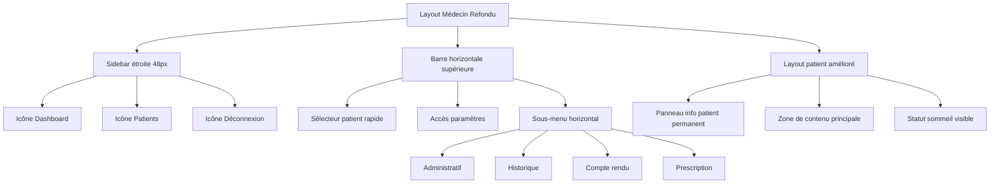

# Plan de Refonte de l'Interface Médecin - Somnolink

## Analyse de l'État Actuel

### Structure Actuelle
- **Sidebar**: 64px de large, texte complet ("Dashboard", "Mes patients")
- **Layout patient**: Deux colonnes (info patient à gauche, contenu à droite)
- **Navigation**: Onglets verticaux dans la colonne de contenu
- **Absence**: Barre horizontale supérieure, sous-menu horizontal, statut sommeil visible

### Problèmes Identifiés
1. Sidebar trop large avec texte redondant
2. Pas d'accès rapide aux fonctions courantes
3. Information patient non toujours visible
4. Navigation peu intuitive dans le dossier patient
5. Absence de statut sommeil en évidence

## Architecture Proposée



## Détails de l'Implémentation

### 1. Nouvelle Sidebar (48px de large)

**Fichier à modifier:** `src/app/dashboard/doctor/layout.tsx`

```tsx
// Nouveau design de la sidebar
<nav className="w-12 bg-gray-900 text-white flex flex-col p-2">
  <div className="text-center mb-6">
    <div className="mx-auto w-8 h-8 bg-green-600 rounded-full flex items-center justify-center text-sm font-bold">
      {initials}
    </div>
  </div>

  <ul className="flex-grow space-y-4">
    <li>
      <Link href="/dashboard/doctor" className="block p-2 rounded hover:bg-gray-700" title="Dashboard">
        <LayoutDashboard className="w-6 h-6 mx-auto" />
      </Link>
    </li>
    <li>
      <Link href="/dashboard/doctor/patients" className="block p-2 rounded hover:bg-gray-700" title="Mes patients">
        <Users className="w-6 h-6 mx-auto" />
      </Link>
    </li>
  </ul>
  
  <form action={signOut}>
    <button type="submit" className="w-full p-2 rounded hover:bg-red-700 text-left" title="Déconnexion">
      <LogOut className="w-6 h-6 mx-auto" />
    </button>
  </form>
</nav>
```

### 2. Barre Horizontale Supérieure

**Nouveau composant:** `src/components/doctor/HeaderBar.tsx`

```tsx
interface HeaderBarProps {
  currentPatient?: Patient;
  onPatientSelect: (patientId: string) => void;
}

const HeaderBar: React.FC<HeaderBarProps> = ({ currentPatient, onPatientSelect }) => {
  return (
    <header className="bg-white border-b border-gray-200 px-6 py-3 flex items-center justify-between">
      {/* Sélecteur de patient */}
      <div className="flex items-center space-x-4">
        <PatientSelector onSelect={onPatientSelect} />
        
        {/* Statut sommeil du patient actuel */}
        {currentPatient && (
          <PatientSleepStatus patient={currentPatient} />
        )}
      </div>

      {/* Menu de navigation et paramètres */}
      <div className="flex items-center space-x-4">
        <button className="p-2 rounded hover:bg-gray-100" title="Nouveau patient">
          <UserPlus className="w-5 h-5" />
        </button>
        <button className="p-2 rounded hover:bg-gray-100" title="Paramètres">
          <Settings className="w-5 h-5" />
        </button>
      </div>
    </header>
  );
};
```

### 3. Sous-Menu Horizontal pour Dossier Patient

**Modification de:** `src/app/dashboard/doctor/patients/[patientId]/page.tsx`

```tsx
// Remplacer la navigation verticale actuelle par un sous-menu horizontal
<div className="bg-white border-b border-gray-200">
  <nav className="flex space-x-8 px-6">
    <Link href={`/dashboard/doctor/patients/${patientId}?tab=administratif`} 
          className={activeTab === 'administratif' ? "border-blue-500 text-blue-600 py-3 border-b-2 font-medium" : "border-transparent text-gray-500 hover:text-gray-700 py-3 border-b-2 font-medium"}>
      Administratif
    </Link>
    <Link href={`/dashboard/doctor/patients/${patientId}?tab=historique`} 
          className={activeTab === 'historique' ? "border-blue-500 text-blue-600 py-3 border-b-2 font-medium" : "border-transparent text-gray-500 hover:text-gray-700 py-3 border-b-2 font-medium"}>
      Historique
    </Link>
    <Link href={`/dashboard/doctor/patients/${patientId}?tab=compte-rendu`} 
          className={activeTab === 'compte-rendu' ? "border-blue-500 text-blue-600 py-3 border-b-2 font-medium" : "border-transparent text-gray-500 hover:text-gray-700 py-3 border-b-2 font-medium"}>
      Compte Rendu
    </Link>
    <Link href={`/dashboard/doctor/patients/${patientId}?tab=prescription`} 
          className={activeTab === 'prescription' ? "border-blue-500 text-blue-600 py-3 border-b-2 font-medium" : "border-transparent text-gray-500 hover:text-gray-700 py-3 border-b-2 font-medium"}>
      Prescription
    </Link>
  </nav>
</div>
```

### 4. Panneau d'Information Patient Permanent

**Nouveau composant:** `src/components/doctor/PatientInfoPanel.tsx`

```tsx
interface PatientInfoPanelProps {
  patient: Patient;
}

const PatientInfoPanel: React.FC<PatientInfoPanelProps> = ({ patient }) => {
  const getSleepStatus = (patient: Patient) => {
    // Logique pour déterminer le statut sommeil
    if (patient.pgv_analysis) return { status: 'appareillé', color: 'green' };
    if (patient.questionnaires?.some(q => q.epworth_total > 10)) return { status: 'dépistage', color: 'orange' };
    return { status: 'en évaluation', color: 'gray' };
  };

  const status = getSleepStatus(patient);

  return (
    <aside className="w-80 bg-white border-l border-gray-200 p-6 h-screen sticky top-0 overflow-y-auto">
      <div className="mb-6">
        <h2 className="text-xl font-bold text-gray-900">
          {formatName(patient.civility, patient.first_name, patient.last_name)}
        </h2>
        <div className="mt-2 flex items-center">
          <span className={`inline-flex items-center px-2.5 py-0.5 rounded-full text-xs font-medium bg-${status.color}-100 text-${status.color}-800`}>
            {status.status.toUpperCase()}
          </span>
        </div>
      </div>

      <div className="space-y-4">
        <div>
          <h3 className="text-sm font-medium text-gray-500">Informations de base</h3>
          <p className="text-sm">{calculateAge(patient.date_of_birth)} ans</p>
          <p className="text-sm">{patient.social_security_number || 'NSS non renseigné'}</p>
        </div>

        <div>
          <h3 className="text-sm font-medium text-gray-500">Antécédents</h3>
          <PatientHistoryCondensed patientId={patient.id} />
        </div>

        <div>
          <h3 className="text-sm font-medium text-gray-500">Allergies</h3>
          <p className="text-sm">{patient.allergies || 'Aucune allergie connue'}</p>
        </div>

        <div>
          <h3 className="text-sm font-medium text-gray-500">Traitements en cours</h3>
          <CurrentTreatments patientId={patient.id} />
        </div>
      </div>
    </aside>
  );
};
```

### 5. Layout Final Intégré

**Structure du nouveau layout:**

```tsx
<div className="flex min-h-screen">
  {/* Sidebar étroite */}
  <nav className="w-12 bg-gray-900 text-white">...</nav>

  {/* Contenu principal */}
  <div className="flex-1 flex flex-col">
    {/* Barre horizontale supérieure */}
    <HeaderBar currentPatient={currentPatient} onPatientSelect={handlePatientSelect} />

    {/* Contenu avec sous-menu et panneau patient */}
    <div className="flex flex-1">
      {/* Zone de contenu principale */}
      <main className="flex-1 p-6 bg-gray-50">
        {/* Sous-menu horizontal */}
        <HorizontalSubMenu patientId={patientId} activeTab={activeTab} />
        
        {/* Contenu de l'onglet sélectionné */}
        <TabContent activeTab={activeTab} patient={patient} />
      </main>

      {/* Panneau d'information patient permanent */}
      <PatientInfoPanel patient={patient} />
    </div>
  </div>
</div>
```

## Étapes d'Implémentation

1. **Modifier le layout médecin** (`src/app/dashboard/doctor/layout.tsx`)
   - Réduire la sidebar à 48px
   - Remplacer le texte par des icônes
   - Ajouter des tooltips

2. **Créer la barre horizontale supérieure** (`src/components/doctor/HeaderBar.tsx`)
   - Sélecteur de patient rapide
   - Boutons d'action (nouveau patient, paramètres)
   - Affichage du statut sommeil

3. **Refondre la page dossier patient** (`src/app/dashboard/doctor/patients/[patientId]/page.tsx`)
   - Ajouter le sous-menu horizontal
   - Intégrer le panneau d'information permanent
   - Adapter le layout pour l'espace disponible

4. **Créer le composant PatientInfoPanel** (`src/components/doctor/PatientInfoPanel.tsx`)
   - Affichage condensé des informations vitales
   - Statut sommeil visible
   - Antécédents et allergies

5. **Ajouter la gestion du statut sommeil**
   - Définir les différents statuts (dépistage, appareillé, etc.)
   - Logique de détermination automatique du statut

6. **Tests et ajustements responsive**
   - Vérifier sur différentes tailles d'écran
   - Ajuster les breakpoints Tailwind
   - Optimiser l'expérience mobile

## Composants à Créer

- `HeaderBar.tsx` - Barre horizontale supérieure
- `PatientSelector.tsx` - Sélecteur de patient rapide
- `PatientSleepStatus.tsx` - Affichage du statut sommeil
- `PatientInfoPanel.tsx` - Panneau d'information permanent
- `HorizontalSubMenu.tsx` - Sous-menu horizontal de navigation
- `PatientHistoryCondensed.tsx` - Version condensée des antécédents

## Icônes Requises (Lucide React)

- LayoutDashboard (Dashboard)
- Users (Patients)
- LogOut (Déconnexion)
- UserPlus (Nouveau patient)
- Settings (Paramètres)
- FileText (Compte rendu)
- ClipboardList (Historique)
- CreditCard (Administratif)
- Pill (Prescription)

Ce plan fournit une base complète pour la refonte de l'interface médecin. La structure proposée améliore significativement l'ergonomie et l'accès aux informations cruciales pour le praticien.